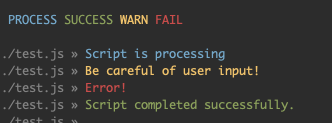
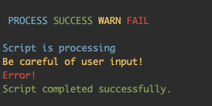

# Maki Color Scripts

> Install scripts for colored output

## Install

```
npx maki-color install ./path/to/scripts
```

This installs the following scripts at `path/to/scripts`:

```
color.js
color.sh
```

## Requirements

- Node >= 8
- NPM >= 5.3

## Usage

Shell scripts:

```
#!/bin/bash
# test.sh

source ./path/to/scripts/color.sh

color_init

color "${BLUE}Script is processing"
color "${YELLOW}Be careful of user input!"
color "${RED}Error!"
color "${GREEN}Script completed successfully."
```

JS scripts:

```
// test.js

const { color, colorInit } = require('./path/to/scripts/color.js'):

colorInit();

color`{BLUE}Script is processing`;
color`{YELLOW}Be careful of user input!`;
color`{RED}Error!`;
color`{GREEN}Script completed successfully.`;
```

0

## Configuration

Set the `$COLOR_ORIGIN` environment variable to turn off the file origin trace:

```
export COLOR_ORIGIN=false
```



## Links

- [Github](https://github.com/underblob/maki-color)
- [NPM package](https://www.npmjs.com/package/maki-color)
- [Report a bug](https://github.com/underblob/maki-color/issues)
